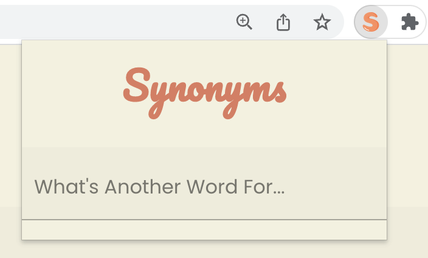
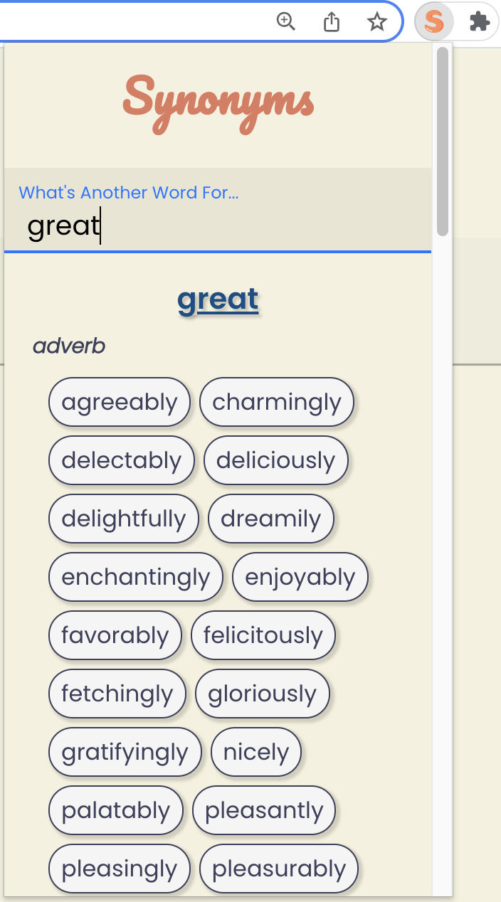
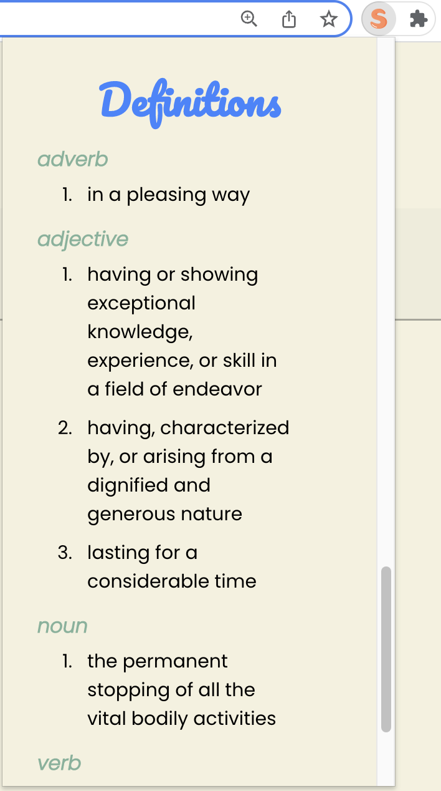
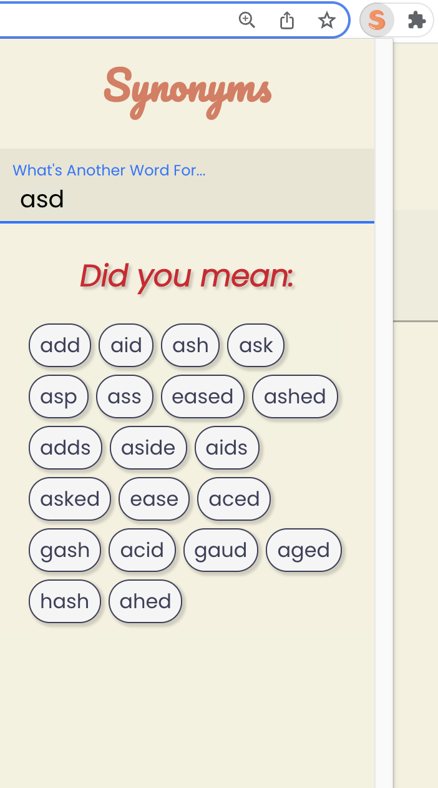
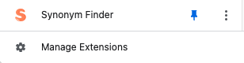

# Synonym Finder

Ever thought to yourself **_What's another word for..._**

Synonym Finder is an application that allows you to conveniently search for a word and displays its synonyms as well as its definitions for each of its parts of speech!

# Demo-Preview

  

# Chrome Web Extension Store

The main functionality of Synonym Finder is to be used as a web browser extension and therefore is currently published on the Chrome Web Extension Store and can be accessed and used immediately by going to the following link and clicking `Add to Chrome`

Visit the extension at: [Synonym Finder](https://chrome.google.com/webstore/detail/synonym-finder/illimocegjikcgmopnajholfanllebic)

Afterwards you can go to your extensions manager and pin it to begin searching for synonyms!



> _Note: For more info on how to clone this application refer to the 'Cloning This Repository' section_

# Features

## Existing Features

#### Dynamic Page

- The application is modeled as a progressive web application to render a single-page-app's functionality without full page reloads and optimized to perform like a native app.

- The application takes advantage of the `useEffect` functionality in which the user is able to search a word dynamically by updating the results upon each key stroke made.

- Since the application displays results "in real time" there was no use for a search bar/button making the design cleaner and simpler for the users experience.

#### Search / Results

- The application is written to return a list of Synonyms organized by each of its parts of speech.
- The application also displays a Definitions section in which it also gives the user a short definition for each of its parts of speech as well.
- The application also displays the current word searched below the search field as reference due to the following action.

- #### Actions:
  - Ability to clear the input field upon clicking the search bar for a more efficient user experience.
  - Ability to click on any given synonyms displayed and search the synonyms for that word as well by using its `/:id`.

#### Suggested words / Non-existent word

- The application is able to give a list of suggestions if the user searches for a word that doesn't exist.

- #### Actions:
  - Ability to display a list of **_Did you mean:_** words
  - Ability to click on any suggested word and display the synonyms and its other results for that word.

## Future Features To Implement

- A "show more" feature that displays more synonyms and results.
- Show a list of antonyms for a searched word.
- Implement a login and authentication feature.
- Implement a database and server.
- Ability to manage a users search history after their browser session.

# Technologies

### API

- [Dictionary Api - Collegiate Thesaurus:](https://dictionaryapi.com/products/api-collegiate-thesaurus) Used the Merriam-Webster Dictionary API, specifically it's Collegiate Thesaurus in which I had to register and request for the API key.

### Frameworks and Libraries

- [Create React App](https://github.com/facebook/create-react-app) This application was bootstrapped with create-react-app.
- [Webpack:](https://webpack.js.org/) The static module bundler that builds a dependency graph mapping every module the project requires.
- [React V^17.0.2:](https://reactjs.org/) React Framework for production and JavaScript Library for building user interfaces.
- [React-router-dom V^5.3.0:](https://www.npmjs.com/package/react-router-dom) The package contains bindings for using React Router in web applications.
- [Babel:](https://babeljs.io/docs/en/) The toolchain compiler that transforms syntax to ensure all evolved code function, namely between `jsx`, `jss` `js`.
- [Axios:](https://github.com/axios/axios) The promise-based HTTP client for the application that handles calls to the Thesaurus API.
- [Sass:](https://sass-lang.com/) An extension of CSS that enables the use of variables, nested rules, inline imports and more. It also helps to keep things organised and allows you to create style sheets more efficiently.

# Cloning This Repository

- Clone this repo by running the following command in your terminal:

```bash
git clone git@github.com:arvin361/synonym-finder.git
```

- at the jump, `cd` to the name of this repository:

```bash
cd synonym-finder
```

- install the necessary packages and dependencies by running:

```bash
npm install
```

- and to run the application on your local host web browser run:

```bash
npm start
```

- this will run the application in the development mode...

- finally open [http://localhost:3000](http://localhost:3000) to view it in your browser and you can immediately start typing any word you like in the search bar for it's synonyms along with it's short definitions and parts of speech!

- Happy searching! 🥳

### Deployment

- To build the app for production and create the `build` folder run:

```bash
npm run build
```

- This correctly bundles React in production mode and optimizes the build for the best performance.
- The build is minified and the filenames include the hashes.
- The application is now ready to be deployed!

See the section about [deployment](https://facebook.github.io/create-react-app/docs/deployment) for more information.

## Learn More

You can learn more in the [Create React App documentation](https://facebook.github.io/create-react-app/docs/getting-started).

To learn React, check out the [React documentation](https://reactjs.org/).
